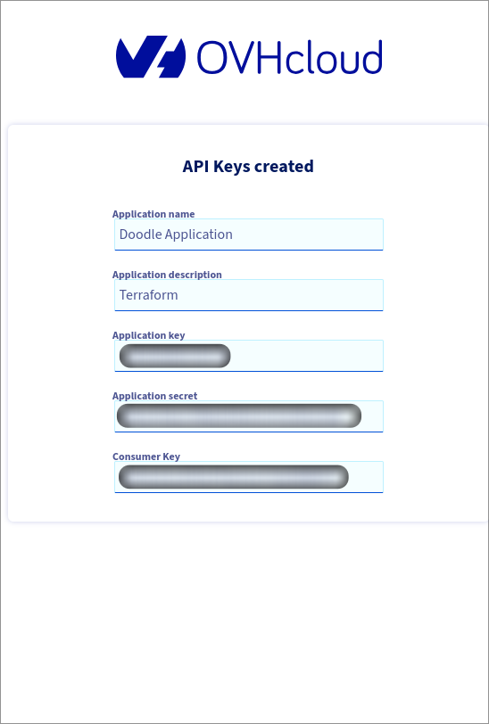

# Configuration Management Tools and Infrastructure as Code

# Infrastructure Declaration using Terraform

We choose to declare all the machine in our infrastructure using Terraform. We use it to declare our infrastructure on OVH Cloud. 

## Terraform

[Terraform](https://developer.hashicorp.com/) is an open-source Infrastructure as Code (IaC) tool developed by HashiCorp that uses a cloud provider–agnostic, declarative language to define and manage infrastructure. It allows users to provision resources across multiple cloud platforms like AWS, Azure, and Google Cloud without needing to learn each provider’s GUI—only Terraform's documentation is needed. Terraform (b1.5+) use the Business Source License (BSL). 

## OVH

[OCHCloud](https://www.ovhcloud.com/en/) is a European cloud service provider offering a wide range of infrastructure solutions, including virtual machines, dedicated servers, web hosting, and public/private cloud services. Known for its strong data privacy practices and competitive pricing, OVHcloud operates its own data centers and global fiber network, providing scalable and secure cloud solutions.

We took OHV Cloud because it is French and that get a 200€ Credit to try different things with it. The Web interface is quite convenient.

## Configuration

We followed [this](https://help.ovhcloud.com/csm/fr-public-cloud-compute-terraform?id=kb_article_view&sysparm_article=KB0050792) OVH tutorial to setup the Terraform using OVH Cloud.

When using Terraform in general we give access to Terraform to perform actions  (Create a network, VM, Bucket, ...) under our CLoud provider account. Thus we need to given some identification token to the Terraform CLI. 

<a href="https://api.ovh.com/createToken/?GET=/*&POST=/*&PUT=/*&DELETE=/*">

</a>

We can than deploy our infrastructure with the followings commands

```sh
# Enter a bash compliant shell

# Create workspace
terraform workspace new test_terraform

# Create .env file

# Source .env
. .env
# Source OpenRC variable from openrc.sh
source ./openrc.sh

# Init terraform project
terraform init
terraform plan

# Create infra
terraform apply

# Delete infra (Optional)
terraform destroy

# Print available Openstack Images
openstack image list --public

# Generate Ansible inventory
terraform output -json | jq .ansible_inventory.value | sed 's/^"\|"$//g' |  { echo -e "$(cat)"; } > ../ansible/environments/production/hosts 
```

# Systems Configuration using Nix

Settings up new machine is time consuming and can become complicated when it need to be done entirely remotely. 
We could use [Ansible](https://github.com/ansible/ansible), or [Chef](https://github.com/chef/chef) that would allow us to create "Cookbook" that specify commands and steps to configure our systems. Those tools are the most used in the industry in term of configuration. But they still have some issue in term of reproducibility and don't prevent configuration drift as they are not immutable.

It all boils down to "Declarative vs Imperative Configuration".


We choose to go the more declarative way and use Nix/NixOS to do the configuration fo the systems. 

[Nix/NixOS](https://nixos.org/) is a powerful tool to create and build reproducible software systems. We can perform the building our project and configure the systems our software will run on using the same language and configuration language. Which is enjoyable & convenient. 

## The Doodle App

The doodle application use multiple services. We have an SQL Server, etherpad and a mail server.

Here is the description of doodle app architecture and dependancies.
- Doodle Frontend (Angular 10/Typescript)
    - Static files served by a httpd server.
    - Port 3000
    - Call by user (Must be publicly available):
        - Doodle Backend with `http://doodle-api:8080` endpoint
        - Etherpad with `http://etherpad:9001`
- Doodle Back (Quarkus/Java JDK 11)
    - Port 8080
    - Call directly (Can be intern):
        - Database with `jdbc:mysql://mysql:3306` endpoint
        - Mail Server with `http://mail:2525`
- Database (MariaDB)
    - Port 3306
- Etherpad 1.8.6
    - Port 9001
- Mail Server
    - Port 2525

# Services Deployment using Kubernetes